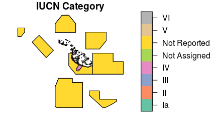

<!--- README.md is generated from README.Rmd. Please edit that file -->
wdpar: Interface to the World Database on Protected Areas
---------------------------------------------------------

[](http://www.repostatus.org/#active) [](https://travis-ci.org/jeffreyhanson/wdpar) [](https://ci.appveyor.com/project/jeffreyhanson/wdpar) [](https://codecov.io/github/jeffreyhanson/wdpar?branch=master) [](https://CRAN.R-project.org/package=wdpar)

### Overview

The *wdpar R* package provides an interface to the World Database on Protected Areas (WDPA). It provides functions for automatically downloading data (from [Protected Planet](http://protectedplanet.net)) and cleaning data following best practices (outlined in [Butchart *et al.* 2015](https://dx.doi.org/10.1111/conl.12158) and [Runge *et al.* 2015](https://dx.doi.org/10.1126/science.aac9180)). These functions are designed to be scalable and can employ parallel processing to complete data processing in a feasible period of time.

### Installation

To install the developmental version of *wdpar*, use the following *R* code:

``` r
if (!require(devtools))
  install.packages("devtools")
devtools::install_github("jeffreyhanson/wdpar")
```

Note that this package requires the developmental version of the [*lwgeom R* package](https://github.com/r-spatial/lwgeom). If you have trouble installing this package, check out its [installation instructions](https://github.com/r-spatial/lwgeom).

### Example usage

Here we will provide a short introduction to the *wdpar R* package.

First, we will load the *wdpar R* package. We will also load the *sf* and *dplyr R* packages to help explore protected area data.

``` r
# load packages
library(wdpar)
library(sf)
library(dplyr)
```

Now we will download protected area data for Malta. Note that we could have alternatively downloaded the data using Malta's [ISO3 code](https://en.wikipedia.org/wiki/ISO_3166-1_alpha-3) (MLT).

``` r
# download protected area data for Malta
mlt_raw_pa_data <- wdpa_fetch("Malta", wait = TRUE)
```

Next, we will clean the data set. Note that we will only use a single thread for data processing, but you could use the `threads` argument to use multiple threads for data processing. See the help page for `wdpa_clean` for a detailed description on the data cleaning process.

``` r
# clean Malta data
mlt_pa_data <- wdpa_clean(mlt_raw_pa_data)
```

    ## [1] 1
    ## Time difference of 0.1951411 secs
    ## [1] 2
    ## Time difference of 0.011693 secs
    ## [1] 3
    ## Time difference of 0.04547334 secs
    ## [1] 4
    ## Time difference of 0.260421 secs
    ## [1] 5
    ## Time difference of 0.008594513 secs
    ## [1] 6
    ## Time difference of 0.1317618 secs
    ## [1] 7
    ## Time difference of 6.484985e-05 secs
    ## [1] 8
    ## Time difference of 0.1013842 secs
    ## [1] 9
    ## Time difference of 0.1102479 secs
    ## [1] 10
    ## Time difference of 0.1072469 secs
    ## [1] 11
    ## Time difference of 0.000351429 secs
    ## [1] 12
    ## Time difference of 0.03872347 secs
    ## [1] 13
    ## [1] 13.1
    ## [1] 13.2
    ## [1] 13.3
    ## Time difference of 0.2839248 secs
    ## [1] 14
    ## Time difference of 0.0007503033 secs
    ## [1] 15
    ## Time difference of 0.01134014 secs
    ## [1] 16
    ## Time difference of 0.005030155 secs
    ## [1] 17

Now that we have finished cleaning the data, let's calculate some statistics. We can calculate the total amount of area inside inside Malta's protected area system (km**<sup>2</sup>). Note that this includes marine and terrestrial protected areas.

``` r
# calculate total amount of area inside protected areas (km^2)
statistic <- mlt_pa_data %>%
             as.data.frame %>%
             summarize(area = sum(AREA_KM2))

# print statistic
print(statistic)
```

    ##           area
    ## 1 1.290205e+16

We can also calculate the percentage of land inside [protected areas that are designated strictly to protect biodiversity (and also potentially geological/geomorphological features)](https://www.iucn.org/theme/protected-areas/about/protected-area-categories).

``` r
# fetch spatial data for Malta's land mass and calculate its area (km^2)
mlt_land_data <- land_and_eez_fetch("Malta") %>%
                 filter(TYPE == "LAND") %>%
                 summarize(area = as.numeric(st_area(.)) * 1e+6)
```

    ## [1] 1
    ## Time difference of 0.2752075 secs
    ## [1] 2
    ## Time difference of 0.01079988 secs
    ## [1] 3
    ## Time difference of 0.039639 secs
    ## [1] 4
    ## Time difference of 0.2080986 secs
    ## [1] 5
    ## Time difference of 0.003622055 secs
    ## [1] 6
    ## Time difference of 0.1237791 secs
    ## [1] 7
    ## Time difference of 0.005626917 secs
    ## [1] 8
    ## Time difference of 0.1300666 secs
    ## [1] 9
    ## Time difference of 0.05291247 secs
    ## [1] 10
    ## Time difference of 0.1890869 secs
    ## [1] 11
    ## Time difference of 0.006444216 secs
    ## [1] 12
    ## Time difference of 0.02789021 secs
    ## [1] 13
    ## [1] 13.1
    ## [1] 13.2
    ## [1] 13.3
    ## Time difference of 0.2677572 secs
    ## [1] 14
    ## Time difference of 0.003177166 secs
    ## [1] 15
    ## Time difference of 0.02062869 secs
    ## [1] 16
    ## Time difference of 0.004937172 secs
    ## [1] 17

``` r
# calculate percentage of land inside protected areas (km^2)
statistic <- mlt_pa_data %>%
             as.data.frame %>%
             filter(MARINE == "terrestrial", IUCN_CAT == "Ia") %>%
             summarize(area_protected = sum(AREA_KM2)) %>%
             mutate(total_land_area = mlt_land_data[["area"]]) %>%
             mutate(percentage_protected = (area_protected / total_land_area) *
                                           100)

# print statistic
print(statistic)
```

    ##   area_protected total_land_area percentage_protected
    ## 1   250391500000    4.949877e+14            0.0505854

Finally, let's plot a map showing Malta's protected areas and color each area according to its management category.

``` r
plot(mlt_pa_data[, "IUCN_CAT"], main = "IUCN Category", key.size = lcm("4"))
```



### Citation

Please use the following references for citing the *wdpar R* package and the World Database on Protected Areas (WDPA) in publications.


    To cite the wdpar package in publications, use:

      UNEP-WCMC and IUCN (2018) Protected Planet: The World Database
      on Protected Areas (WDPA), [insert month/year of the version
      downloaded], Cambridge, UK: UNEP-WCMC and IUCN. Available at:
      www.protectedplanet.net.

      Hanson JO (2018) wdpar: Interface to the World Database on
      Protected Areas. R package version 0.0.0.1. Available at:
      https://github.com/jeffreyhanson/wdpar

    Please cite both the World Database on Protected Areas data set
    and this package.
    To see these entries in BibTeX format, use 'print(<citation>,
    bibtex=TRUE)', 'toBibtex(.)', or set
    'options(citation.bibtex.max=999)'.
