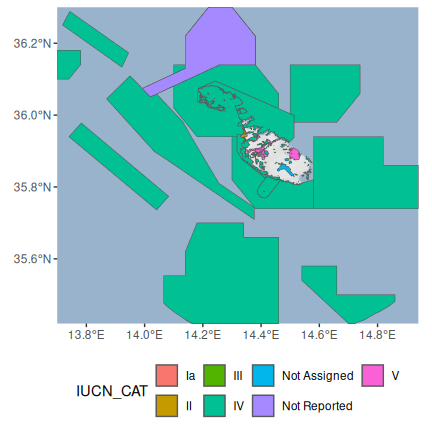

<!--- README.md is generated from README.Rmd. Please edit that file -->
wdpar: Interface to the World Database on Protected Areas
---------------------------------------------------------

[](https://www.tidyverse.org/lifecycle/#stable) [](https://github.com/prioritizr/wdpar/actions) [](https://github.com/prioritizr/wdpar/actions) [](https://github.com/prioritizr/wdpar/actions) [](https://codecov.io/github/prioritizr/wdpar?branch=master) [](https://CRAN.R-project.org/package=wdpar)

### Overview

The [World Database on Protected Areas (WDPA)](https://www.protectedplanet.net/en) is the most comprehensive global dataset of protected areas. It is used to monitor the performance of existing protected areas and pinpoint priority areas for establishing new protected areas. Additionally, this database receives monthly updates from government agencies and non-governmental organizations. However, this dataset is associated with [many issues that need to be addressed prior to analysis](https://www.protectedplanet.net/en/resources/calculating-protected-area-coverage) and the dynamic nature of this dataset means that the entire data cleaning process needs to be repeated after obtaining a new version of the dataset. The *wdpar R* package provides an interface to the [World Database on Protected Areas (WDPA)](https://www.protectedplanet.net/en) and functions for cleaning the data following best practices (outlined in [Butchart *et al.* 2015](https://doi.org/10.1111/conl.12158); [Runge *et al.* 2015](https://science.sciencemag.org/content/350/6265/1255); [Protected Planet](https://www.protectedplanet.net/en/resources/calculating-protected-area-coverage)).

### Installation

The [latest official version of the *wdpar R* package](https://CRAN.R-project.org/package=wdpar) can be installed using the following R code. Please note that this package requires the [*curl*](https://github.com/jeroen/curl) and [*sf R*](https://github.com/r-spatial/sf) packages which may require additional software to be installed. If you encounter problems installing the *wdpar R* package, please consult the installation instructions for these packages.

``` r
install.packages("wdpar", repos = "https://cran.rstudio.com/")
```

Alternatively, the latest developmental version can be installed using the following *R* code. Please note that while developmental versions may contain additional features not present in the official version, they may also contain coding errors.

``` r
if (!require(devtools))
  install.packages("devtools")
devtools::install_github("prioritizr/wdpar")
```

### Usage

Here we will provide a short introduction to the *wdpar R* package. First, we will load the *wdpar R* package. We will also load the *dplyr* and *ggmap R* packages to help explore the data.

``` r
# load packages
library(wdpar)
library(dplyr)
library(ggmap)
```

Now we will download protected area data for Malta from [Protected Planet](https://www.protectedplanet.net/en). We can achieve this by specifying Malta's country name (i.e. `"Malta"`) or Malta's [ISO3 code](https://en.wikipedia.org/wiki/ISO_3166-1_alpha-3) (i.e. `"MLT"`).

``` r
# download protected area data for Malta
mlt_raw_pa_data <- wdpa_fetch("Malta", wait = TRUE)
```

Next, we will clean the data set. Briefly, the cleaning steps include: excluding protected areas that are not yet implemented, excluding protected areas with limited conservation value, replacing missing data codes (e.g. `"0"`) with missing data values (i.e. `NA`), replacing protected areas represented as points with circular protected areas that correspond to their reported extent, repairing any topological issues with the geometries, and erasing overlapping areas. For more information, see `?wdpa_clean`.

``` r
# clean Malta data
mlt_pa_data <- wdpa_clean(mlt_raw_pa_data)
```

Print preview of the data associated with each protected area.

``` r
# print preview
head(mlt_pa_data)
```

    ## Simple feature collection with 6 features and 32 fields
    ## geometry type:  MULTIPOLYGON
    ## dimension:      XY
    ## bbox:           xmin: 1369012 ymin: 4280784 xmax: 1399694 ymax: 4307909
    ## CRS:            +proj=cea +lon_0=0 +lat_ts=30 +x_0=0 +y_0=0 +datum=WGS84 +ellps=WGS84 +units=m +no_defs
    ## precision:      1500 
    ## # A tibble: 6 x 33
    ##   WDPAID WDPA_PID PA_DEF NAME  ORIG_NAME DESIG DESIG_ENG DESIG_TYPE IUCN_CAT
    ##    <dbl> <chr>    <chr>  <chr> <chr>     <chr> <chr>     <chr>      <chr>   
    ## 1 1.94e5 194420   1      Filf… Filfla    Rise… Nature R… National   Ia      
    ## 2 1.94e5 194423   1      Il-Ġ… Il-Ġebla… Rise… Nature R… National   Ia      
    ## 3 1.94e5 194425   1      Il-G… Il-Gżejj… Rise… Nature R… National   Ia      
    ## 4 5.56e8 5555886… 1      Il-M… Il-Majji… Park… National… National   II      
    ## 5 1.75e5 174757   1      Il-Ġ… Il-Ġonna… List… List Of … National   III     
    ## 6 1.75e5 174758   1      Bidn… Bidnija,… List… List Of … National   III     
    ## # … with 24 more variables: INT_CRIT <chr>, MARINE <chr>, REP_M_AREA <dbl>,
    ## #   GIS_M_AREA <dbl>, REP_AREA <dbl>, GIS_AREA <dbl>, NO_TAKE <chr>,
    ## #   NO_TK_AREA <dbl>, STATUS <chr>, STATUS_YR <dbl>, GOV_TYPE <chr>,
    ## #   OWN_TYPE <chr>, MANG_AUTH <chr>, MANG_PLAN <chr>, VERIF <chr>,
    ## #   METADATAID <int>, SUB_LOC <chr>, PARENT_ISO <chr>, ISO3 <chr>,
    ## #   SUPP_INFO <chr>, CONS_OBJ <chr>, GEOMETRY_TYPE <chr>, AREA_KM2 <dbl>,
    ## #   geometry <MULTIPOLYGON [m]>

Finally, after cleaning the data, let's plot a map showing Malta's protected areas and color each area according to its management category ([as defined by the The International Union for Conservation of Nature](https://www.iucn.org/theme/protected-areas/about/protected-area-categories)).

``` r
# reproject data to longitude/latitude for plotting
mlt_pa_data <- st_transform(mlt_pa_data, 4326)

# download basemap imagery
bg <- get_stamenmap(unname(st_bbox(mlt_pa_data)), zoom = 8,
                    maptype = "watercolor", force = TRUE)

# make map
ggmap(bg) +
geom_sf(aes(fill = IUCN_CAT), data = mlt_pa_data, inherit.aes = FALSE) +
theme(axis.title = element_blank(), legend.position = "bottom")
```



If you need to calculate protected area coverage statistics for a country, please note that you will need to manually clip the cleaned protected area data to the countries' coastline and its Exclusive Economic Zone (EEZ) to obtain accurate results (see [official data cleaning guidelines](https://www.protectedplanet.net/en/resources/calculating-protected-area-coverage)). This step is not performed by the *wdpar R* package because there is no single "best" coastline and Exclusive Economic Zone (EEZ) dataset, since the "best" dataset for any given project depends on the level of required precision and available computational resources. For more examples---including an example of clipping the cleaned data to a coastline---please refer to the [package vignette](https://prioritizr.github.io/wdpar/articles/wdpar.html).

### Citation

Please cite the *wdpar R* package and the World Database on Protected Areas (WDPA) in publications.


    To cite the wdpar package in publications, use:

      Hanson JO (2020) wdpar: Interface to the World Database on Protected
      Areas. R package version 1.0.5.1. https://github.com/prioritizr/wdpar

      UNEP-WCMC and IUCN (2020) Protected Planet: The World Database on
      Protected Areas (WDPA), [insert month/year of the version
      downloaded], Cambridge, UK: UNEP-WCMC and IUCN. Available at:
      www.protectedplanet.net.

    Please cite both the World Database on Protected Areas data set and
    this package.
    To see these entries in BibTeX format, use 'print(<citation>,
    bibtex=TRUE)', 'toBibtex(.)', or set
    'options(citation.bibtex.max=999)'.
