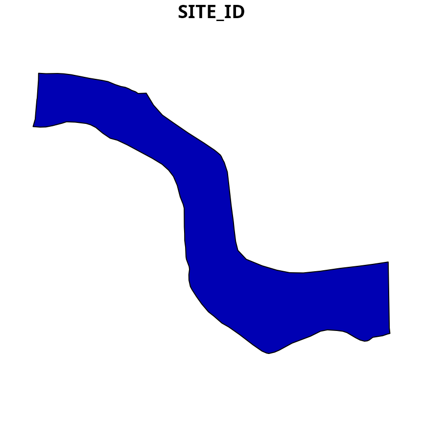
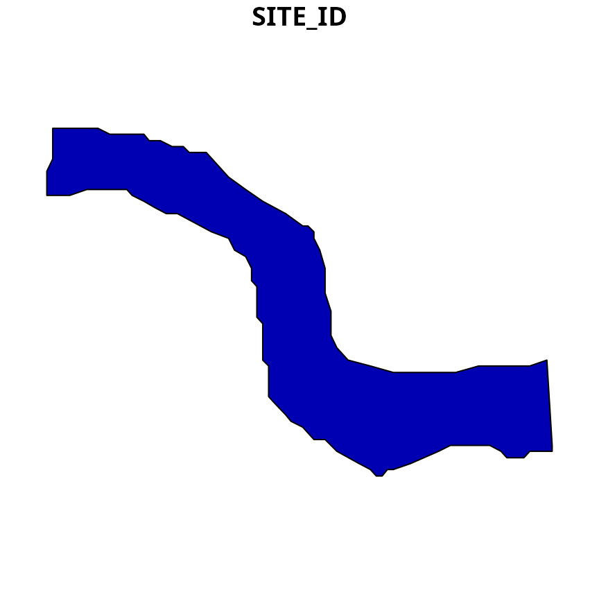

# wdpar: Interface to the World Database on Protected Areas

### Introduction

[Protected Planet](https://www.protectedplanet.net/en) provides the most
comprehensive data for conservation areas worldwide. Specifically, it
provides the World Database on Protected Areas (WDPA) and the World
Database on Other Effective Area-Based Conservation Measures (WDOECM).
These databases are used to monitor the performance of existing
protected areas, and identify priority areas for future conservation
efforts. Additionally, these databases receive monthly updates from
government agencies and non-governmental organizations. However, they
are associated with [several issues that need to be addressed prior to
analysis](https://www.protectedplanet.net/en/resources/calculating-protected-area-coverage)
and the dynamic nature of these databases means that the entire data
cleaning process needs to be repeated after obtaining a new version.

The *wdpar R* package provides an interface to data available on
[Protected Planet](https://www.protectedplanet.net/en). Specifically, it
can be used to automatically obtain data from the [World Database on
Protected Areas
(WDPA)](https://www.protectedplanet.net/en/thematic-areas/wdpa?tab=WDPA)
and the [World Database on Other Effective Area-Based Conservation
Measures
(WDOECM)](https://www.protectedplanet.net/en/thematic-areas/oecms). It
also provides methods for cleaning data from these databases following
best practices (outlined in Butchart *et al.* 2015; [Protected Planet
2021](https://www.protectedplanet.net/en/resources/calculating-protected-area-coverage);
Runge *et al.* 2015). In this vignette, we provide a tutorial and
recommendations for using the package.

### Tutorial

Here we will provide a short introduction to the *wdpar R* package.
First, we will load the *wdpar R* package. We will also load the *dplyr*
and *ggmap R* packages to help explore the data.

``` r
# load packages
library(wdpar)
library(dplyr)
library(ggmap)
```

Now we will download protected area data for Malta from [Protected
Planet](https://www.protectedplanet.net/en). We can achieve this by
specifying Malta’s country name (i.e. `"Malta"`) or Malta’s [ISO3
code](https://en.wikipedia.org/wiki/ISO_3166-1_alpha-3) (i.e. `"MLT"`).
Since data are downloaded to a temporary directory by default, we will
specify that the data should be downloaded to a persistent directory.
This means that R won’t have to re-download the same dataset every time
we restart our R session, and R can simply re-load previously downloaded
datasets as needed.

``` r
# download protected area data for Malta
# (excluding areas represented as point localities)
mlt_raw_pa_data <- wdpa_fetch(
  "Malta", wait = TRUE, download_dir = rappdirs::user_data_dir("wdpar")
)
```

Next, we will clean the data set. Briefly, the cleaning steps include:
excluding protected areas that are not yet implemented, excluding
protected areas with limited conservation value, replacing missing data
codes (e.g. `"0"`) with missing data values (i.e. `NA`), replacing
protected areas represented as points with circular protected areas that
correspond to their reported extent, repairing any topological issues
with the geometries, and erasing overlapping areas. Please note that, by
default, spatial data processing is performed at a scale suitable for
national scale analyses (see below for recommendations for local scale
analyses). For more information on the data cleaning procedures, see
[`wdpa_clean()`](../reference/wdpa_clean.md).

``` r
# clean Malta data
mlt_pa_data <- wdpa_clean(mlt_raw_pa_data)
```

After cleaning the data set, we will perform an additional step that
involves clipping the terrestrial protected areas to Malta’s coastline.
Ideally, we would also clip the marine protected areas to Malta’s
Exclusive Economic Zone (EEZ) but such data are not as easy to obtain on
a per country basis (but see <https://www.marineregions.org/eez.php>)).

``` r
# download Malta boundary from Global Administrative Areas dataset
file_path <- tempfile(fileext = ".gpkg")
download.file(
  "https://geodata.ucdavis.edu/gadm/gadm4.1/gpkg/gadm41_MLT.gpkg",
  file_path
)

# import Malta's boundary
mlt_boundary_data <- sf::read_sf(file_path, "ADM_ADM_0")

# repair any geometry issues, dissolve the border, reproject to same
# coordinate system as the protected area data, and repair the geometry again
mlt_boundary_data <-
  mlt_boundary_data %>%
  st_set_precision(1000) %>%
  sf::st_make_valid() %>%
  st_set_precision(1000) %>%
  st_combine() %>%
  st_union() %>%
  st_set_precision(1000) %>%
  sf::st_make_valid() %>%
  st_transform(st_crs(mlt_pa_data)) %>%
  sf::st_make_valid()

# clip Malta's protected areas to the coastline
mlt_pa_data <-
  mlt_pa_data %>%
  filter(REALM == "Terrestrial") %>%
  st_intersection(mlt_boundary_data) %>%
  rbind(mlt_pa_data %>%
        filter(REALM == "Marine") %>%
        st_difference(mlt_boundary_data)) %>%
  rbind(mlt_pa_data %>% filter(!REALM %in% c("Terrestrial", "Marine")))
```

    ## Warning: attribute variables are assumed to be spatially constant throughout
    ## all geometries
    ## Warning: attribute variables are assumed to be spatially constant throughout
    ## all geometries

``` r
# recalculate the area of each protected area
mlt_pa_data <-
  mlt_pa_data %>%
  mutate(AREA_KM2 = as.numeric(st_area(.)) * 1e-6)
```

Now that we have finished cleaning the data, let’s preview the data. For
more information on what these columns mean, please refer to the
[official
manual](https://www.protectedplanet.net/en/resources/wdpa-manual)
(available in English, French, Spanish, and Russian).

``` r
# print first six rows of the data
head(mlt_pa_data)
```

    ## Simple feature collection with 6 features and 35 fields
    ## Geometry type: GEOMETRY
    ## Dimension:     XY
    ## Bounding box:  xmin: 1382584 ymin: 4289200 xmax: 1406320 ymax: 4298958
    ## Projected CRS: World_Behrmann
    ## # A tibble: 6 × 36
    ##    SITE_ID SITE_PID SITE_TYPE NAME_ENG NAME  DESIG DESIG_ENG DESIG_TYPE IUCN_CAT
    ##      <int> <chr>    <chr>     <chr>    <chr> <chr> <chr>     <chr>      <chr>   
    ## 1   5.56e8 5557003… PA        "Il-Pon… "Il-… Rise… Nature R… National   Ia      
    ## 2   5.56e8 5555886… PA        "Il-Maj… "Il-… Park… National… National   II      
    ## 3   5.56e8 5557717… PA        "L-Inħa… "L-I… Park… National… National   II      
    ## 4   1.75e5 174757   PA        "Il-Ġon… "Il-… List… List of … National   III     
    ## 5   1.75e5 174758   PA        "Bidnij… "Bid… List… List of … National   III     
    ## 6   1.94e5 194415   PA        "Il-Ġon… "Il-… List… List of … National   III     
    ## # ℹ 27 more variables: INT_CRIT <chr>, REALM <chr>, REP_M_AREA <dbl>,
    ## #   GIS_M_AREA <dbl>, REP_AREA <dbl>, GIS_AREA <dbl>, NO_TAKE <chr>,
    ## #   NO_TK_AREA <dbl>, STATUS <chr>, STATUS_YR <dbl>, GOV_TYPE <chr>,
    ## #   GOVSUBTYPE <chr>, OWN_TYPE <chr>, OWNSUBTYPE <chr>, MANG_AUTH <chr>,
    ## #   MANG_PLAN <chr>, VERIF <chr>, METADATAID <int>, PRNT_ISO3 <chr>,
    ## #   ISO3 <chr>, SUPP_INFO <chr>, CONS_OBJ <chr>, INLND_WTRS <chr>,
    ## #   OECM_ASMT <chr>, GEOMETRY_TYPE <chr>, AREA_KM2 <dbl>, …

We will now reproject the data to longitude/latitude coordinates
([EPSG:4326](https://spatialreference.org/ref/epsg/4326/)) for
visualization purposes.

``` r
# reproject data
mlt_pa_data <- st_transform(mlt_pa_data, 4326)
```

Next, we can plot a map showing the boundaries of Malta’s protected area
system.

``` r
# download basemap for making the map
bg <- get_stadiamap(
  unname(st_bbox(mlt_pa_data)), zoom = 8,
  maptype = "stamen_terrain_background", force = TRUE
)

# print map
ggmap(bg) +
geom_sf(data = mlt_pa_data, fill = "#31A35480", inherit.aes = FALSE) +
theme(axis.title = element_blank())
```


We can also create a histogram showing the year when each protected area
was established.

``` r
hist(
  mlt_pa_data$STATUS_YR,
  main = "Malta's protected areas",
  xlab = "Year established"
)
```


Now let’s calculate some statistics. We can calculate the total amount
of land and ocean inside Malta’s protected area system (km²).

``` r
# calculate total amount of area inside protected areas (km^2)
statistic <-
  mlt_pa_data %>%
  as.data.frame() %>%
  select(-geometry) %>%
  group_by(REALM) %>%
  summarize(area_km = sum(AREA_KM2)) %>%
  ungroup() %>%
  arrange(desc(area_km))

# print statistic
print(statistic)
```

    ## # A tibble: 3 × 2
    ##   REALM       area_km
    ##   <chr>         <dbl>
    ## 1 Marine      4523.  
    ## 2 Terrestrial   84.0 
    ## 3 Coastal        8.91

We can also calculate the percentage of land inside its protected area
system that are managed under different categories (i.e. [using the
protected area management categories defined by The International Union
for Conservation of Nature](https://iucn.org/)).

``` r
# calculate percentage of land inside protected areas (km^2)
statistic <-
  mlt_pa_data %>%
  as.data.frame() %>%
  select(-geometry) %>%
  group_by(IUCN_CAT) %>%
  summarize(area_km = sum(AREA_KM2)) %>%
  ungroup() %>%
  mutate(percentage = (area_km / sum(area_km)) * 100) %>%
  arrange(desc(area_km))

# print statistic
print(statistic)
```

    ## # A tibble: 7 × 3
    ##   IUCN_CAT      area_km percentage
    ##   <chr>           <dbl>      <dbl>
    ## 1 IV           4191.      90.8    
    ## 2 Not Reported  390.       8.45   
    ## 3 V              22.1      0.478  
    ## 4 Not Assigned    8.39     0.182  
    ## 5 II              3.39     0.0734 
    ## 6 III             0.191    0.00414
    ## 7 Ia              0.101    0.00218

We can also plot a map showing Malta’s protected areas and color each
area according to it’s management category.

``` r
ggmap(bg) +
geom_sf(aes(fill = IUCN_CAT), data = mlt_pa_data, inherit.aes = FALSE) +
theme(axis.title = element_blank(), legend.position = "bottom")
```


### Recommended practices for large datasets

The *wdpar R* package can be used to clean large datasets assuming that
sufficient computational resources and time are available. Indeed, it
can clean data spanning large countries, multiple countries, and even
the full global dataset. When processing the full global dataset, it is
recommended to use a computer system with at least 32 GB RAM available
and to allow for at least one full day for the data cleaning procedures
to complete. It is also recommended to avoid using the computer system
for any other tasks while the data cleaning procedures are being
completed, because they are very computationally intensive.
Additionally, when processing large datasets – and especially for the
global dataset – it is strongly recommended to disable the procedure for
erasing overlapping areas. This is because the built-in procedure for
erasing overlaps is very time consuming when processing many protected
areas, so that information on each protected area can be output
(e.g. IUCN category, year established). Instead, when cleaning large
datasets, it is recommended to run the data cleaning procedures with the
procedure for erasing overlapping areas disabled (i.e. with
`erase_overlaps = FALSE`). After the data cleaning procedures have
completed, the protected area data can be manually dissolved to remove
overlapping areas (e.g. using
[`wdpa_dissolve()`](../reference/wdpa_dissolve.md)). For an example of
these procedures, please see below.

``` r
# download protected area data for multiple of countries
## (i.e. Portugal, Spain, France)
raw_pa_data <-
  c("PRT", "ESP", "FRA") %>%
  lapply(wdpa_fetch, wait = TRUE,
         download_dir = rappdirs::user_data_dir("wdpar")) %>%
  bind_rows()
```

``` r
# clean protected area data (with procedure for erasing overlaps disabled)
full_pa_data <- wdpa_clean(raw_pa_data, erase_overlaps = FALSE)

# at this stage, the data could be filtered based on extra criteria (if needed)
## for example, we could subset the data to only include protected areas
## classified as IUCN category Ia or Ib
sub_pa_data <-
  full_pa_data %>%
  filter(IUCN_CAT %in% c("Ia", "Ib"))

# dissolve all geometries together (removing spatial overlaps)
pa_data <- wdpa_dissolve(sub_pa_data)

# preview data
print(pa_data)
```

    ## Simple feature collection with 1 feature and 1 field
    ## Geometry type: MULTIPOLYGON
    ## Dimension:     XY
    ## Bounding box:  xmin: -3274101 ymin: 3403947 xmax: 879505 ymax: 5609364
    ## Projected CRS: World_Behrmann
    ## Precision:     1500 
    ##   id                       geometry
    ## 1  1 MULTIPOLYGON (((-1747881 34...

``` r
# calculate total area
print(st_area(pa_data))
```

    ## 10302220212 [m^2]

### Recommended practices for local scale analyses

The default parameters for the data cleaning procedures are well suited
for national-scale analyses. Although these parameters reduce memory
requirements and the time needed to complete the data cleaning
procedures, they can produce protected area boundaries that appear
overly “blocky” – lacking smooth edges – when viewed at finer scales. As
such, it is strongly recommended to increase the level of spatial
precision when cleaning data for local scale analyses (via the
`geometry_precision` parameter of the
[`wdpa_clean()`](../reference/wdpa_clean.md) function).

Here we will explore the consequences of using the default parameters
for the data cleaning procedures when working at a local scale. This
will help illustrate why it can be important to adjust the spatial
precision of the data cleaning procedures. To begin with, we will obtain
data for a small protected area. Specifically, we will extract a
protected area from the Malta dataset we downloaded earlier.

``` r
# find id for smallest reserve in cleaned dataset
mlt_reserve_id <- mlt_pa_data$SITE_ID[which.min(mlt_pa_data$AREA_KM2)]

# extract the smallest reserve from the raw dataset
mlt_raw_reserve_data <-
  mlt_raw_pa_data %>%
  filter(SITE_ID == mlt_reserve_id)

# preview data
print(mlt_raw_reserve_data)
```

    ## Simple feature collection with 1 feature and 33 fields
    ## Geometry type: MULTIPOLYGON
    ## Dimension:     XY
    ## Bounding box:  xmin: 14.24996 ymin: 36.01383 xmax: 14.25889 ymax: 36.0195
    ## Geodetic CRS:  WGS 84
    ## # A tibble: 1 × 34
    ##   SITE_ID SITE_PID SITE_TYPE NAME_ENG  NAME  DESIG DESIG_ENG DESIG_TYPE IUCN_CAT
    ## *   <int> <chr>    <chr>     <chr>     <chr> <chr> <chr>     <chr>      <chr>   
    ## 1  330746 330746   PA        "Ta\\' Ċ… "Ta\… Sit … Site of … National   IV      
    ## # ℹ 25 more variables: INT_CRIT <chr>, REALM <chr>, REP_M_AREA <dbl>,
    ## #   GIS_M_AREA <dbl>, REP_AREA <dbl>, GIS_AREA <dbl>, NO_TAKE <chr>,
    ## #   NO_TK_AREA <dbl>, STATUS <chr>, STATUS_YR <int>, GOV_TYPE <chr>,
    ## #   GOVSUBTYPE <chr>, OWN_TYPE <chr>, OWNSUBTYPE <chr>, MANG_AUTH <chr>,
    ## #   MANG_PLAN <chr>, VERIF <chr>, METADATAID <int>, PRNT_ISO3 <chr>,
    ## #   ISO3 <chr>, SUPP_INFO <chr>, CONS_OBJ <chr>, INLND_WTRS <chr>,
    ## #   OECM_ASMT <chr>, geometry <MULTIPOLYGON [°]>

``` r
# visualize data
plot(mlt_raw_reserve_data[, 1])
```



We can see that the boundary for this protected area has a high level of
detail. This suggests that the protected area data is available at a
resolution that is sufficient to permit local scale analyses. To help
understand the consequences of cleaning data with the default
parameters, we will clean this dataset using the default parameters.

``` r
# clean the data with default parameters
mlt_default_cleaned_reserve_data <- wdpa_clean(mlt_raw_reserve_data)

# preview data
print(mlt_default_cleaned_reserve_data)
```

    ## Simple feature collection with 1 feature and 35 fields
    ## Geometry type: POLYGON
    ## Dimension:     XY
    ## Bounding box:  xmin: 1375122 ymin: 4304454 xmax: 1375830 ymax: 4305007
    ## Projected CRS: World_Behrmann
    ## # A tibble: 1 × 36
    ##   SITE_ID SITE_PID SITE_TYPE NAME_ENG  NAME  DESIG DESIG_ENG DESIG_TYPE IUCN_CAT
    ##     <int> <chr>    <chr>     <chr>     <chr> <chr> <chr>     <chr>      <chr>   
    ## 1  330746 330746   PA        "Ta\\' Ċ… "Ta\… Sit … Site of … National   IV      
    ## # ℹ 27 more variables: INT_CRIT <chr>, REALM <chr>, REP_M_AREA <dbl>,
    ## #   GIS_M_AREA <dbl>, REP_AREA <dbl>, GIS_AREA <dbl>, NO_TAKE <chr>,
    ## #   NO_TK_AREA <dbl>, STATUS <chr>, STATUS_YR <dbl>, GOV_TYPE <chr>,
    ## #   GOVSUBTYPE <chr>, OWN_TYPE <chr>, OWNSUBTYPE <chr>, MANG_AUTH <chr>,
    ## #   MANG_PLAN <chr>, VERIF <chr>, METADATAID <int>, PRNT_ISO3 <chr>,
    ## #   ISO3 <chr>, SUPP_INFO <chr>, CONS_OBJ <chr>, INLND_WTRS <chr>,
    ## #   OECM_ASMT <chr>, GEOMETRY_TYPE <chr>, AREA_KM2 <dbl>, …

``` r
# visualize data
plot(mlt_default_cleaned_reserve_data[, 1])
```


After cleaning the data with the default parameters, we can see that the
boundary of the protected area is no longer highly detailed. For
example, the smooth edges of the raw protected area data have been
replaced with sharp, blocky edges. As such, subsequent analysis
performed at the local scale – such as calculating the spatial extent of
land cover types within this single protected area – might not be
sufficiently precise. Now, let’s clean the data using parameters that
are well suited for local scale analysis.

``` r
# clean the data with default parameters
mlt_fixed_cleaned_reserve_data <- wdpa_clean(
  mlt_raw_reserve_data, geometry_precision = 10000
)

# preview data
print(mlt_fixed_cleaned_reserve_data)
```

    ## Simple feature collection with 1 feature and 35 fields
    ## Geometry type: POLYGON
    ## Dimension:     XY
    ## Bounding box:  xmin: 1374929 ymin: 4304433 xmax: 1375788 ymax: 4305024
    ## Projected CRS: World_Behrmann
    ## # A tibble: 1 × 36
    ##   SITE_ID SITE_PID SITE_TYPE NAME_ENG  NAME  DESIG DESIG_ENG DESIG_TYPE IUCN_CAT
    ##     <int> <chr>    <chr>     <chr>     <chr> <chr> <chr>     <chr>      <chr>   
    ## 1  330746 330746   PA        "Ta\\' Ċ… "Ta\… Sit … Site of … National   IV      
    ## # ℹ 27 more variables: INT_CRIT <chr>, REALM <chr>, REP_M_AREA <dbl>,
    ## #   GIS_M_AREA <dbl>, REP_AREA <dbl>, GIS_AREA <dbl>, NO_TAKE <chr>,
    ## #   NO_TK_AREA <dbl>, STATUS <chr>, STATUS_YR <dbl>, GOV_TYPE <chr>,
    ## #   GOVSUBTYPE <chr>, OWN_TYPE <chr>, OWNSUBTYPE <chr>, MANG_AUTH <chr>,
    ## #   MANG_PLAN <chr>, VERIF <chr>, METADATAID <int>, PRNT_ISO3 <chr>,
    ## #   ISO3 <chr>, SUPP_INFO <chr>, CONS_OBJ <chr>, INLND_WTRS <chr>,
    ## #   OECM_ASMT <chr>, GEOMETRY_TYPE <chr>, AREA_KM2 <dbl>, …

``` r
# visualize data
plot(mlt_fixed_cleaned_reserve_data[, 1])
```



Here, we specified that the spatial data processing should be performed
at a much greater level of precision (using the `geometry_precision`
parameter). As a consequence, we can see – after applying the data
cleaning procedures – that the protected area boundary still retains a
high level of detail. This means that the cleaned protected area data is
more suitable for local scale analysis. If a greater level of detail is
required, the level of precision could be increased further. Note that
the maximum level of detail that can be achieved in the cleaned data is
limited by the level of detail in the raw data. This means that
increasing the level of precision beyond a certain point will have no
impact on the cleaned data, because the raw data do not provide
sufficient detail for the increased precision to alter the spatial data
processing.

### Additional datasets

Although the [World Database on Protected Areas
(WDPA)](https://www.protectedplanet.net/en) is the most comprehensive
global dataset, many datasets are available for specific countries or
regions that do not require such extensive data cleaning procedures. As
a consequence, it is often worth looking for alternative data sets when
working at smaller geographic scales before considering the [World
Database on Protected Areas (WDPA)](https://www.protectedplanet.net/en).
The list below outlines several alternative protected area datasets and
information on where they can be obtained. If you know of any such
datasets that are missing, [please create an issue on the GitHub
repository](https://github.com/prioritizr/wdpar/issues) and we can add
them to the list.

- Arctic
  - [Arctic Protected Areas -
    2017](http://geo.abds.is/geonetwork/srv/eng/catalog.search#/metadata/2e56ee1f-50a9-4983-88f4-edaa8588950d)
- Australia
  - [Collaborative Australian Protected Area Database
    (CAPAD)](https://fed.dcceew.gov.au/datasets/erin::collaborative-australian-protected-areas-database-capad-2022-terrestrial)
  - [Conservation Areas Reporting and Tracking System
    (CARTS)](https://ccea-ccae.org)
- The United States of America
  - [Protected Areas Database of the US
    (PAD-US)](https://doi.org/10.5066/P9Q9LQ4B)

### Citation

Please cite the *wdpar R* package and the relevant databases in
publications. To see citation details, use the code:

``` r
citation("wdpar")
```
